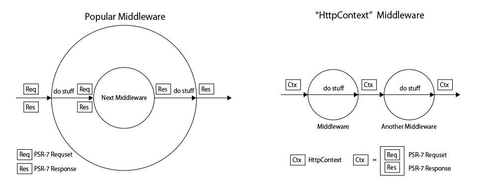

# HttpContextInterface and HttpHandlerInterface
Additional interfaces for PSR-7 HTTP Messages.
Make PSR-7 HTTP middlewares (or applications) simpler and more composable.

## HttpContext
HttpContext holds PSR-7 HTTP request, HTTP response, and state.

```php
interface HttpContextInterface
{
    public function getRequest() : ServerRequestInterface;

    public function getResponse() : ResponseInterface;

    public function isTerminated(): bool;

    public function withRequest(ServerRequestInterface $request): HttpContextInterface;

    public function withResponse(ResponseInterface $response): HttpContextInterface;

    public function withIsTerminated(bool $isTerminated): HttpContextInterface;

    public function handledBy(HttpHandlerInterface $handler): HttpContextInterface;

}
```

## HttpHandler
Handles HttpContext.
An abstraction of Http middlewares, HTTP applications, or controller actions in typical MVC web frameworks.

```php
interface HttpHandlerInterface
{
    public function __invoke(HttpContextInterface $context) : HttpContextInterface;
}
```

# Comparison with popular PSR-7 middlewares
* No callable chain
* Naturally compose pipeline




# Example

```php
use Psr\Http\Message\ServerRequestInterface;
use Psr\Http\Message\ResponseInterface;
use N1215\Http\Context\HttpContextInterface;
use N1215\Http\Context\HttpHandlerInterface;

class HttpHandler implements HttpHandlerInterface {

    public function __invoke(HttpContextInterface $context): HttpContextInterface
    {
        //do stuff
        $context->getResponse()->getBody()->write('Hello, world!');
        return $context;
    }

}

/**
 * @var ServerRequestInterface $request
 */
$request = ServerRequestFactory::fromGlobals();

/**
 * @var ResponseInterface $response
 */
$response = new Response();

$context = new HttpContext($request, $response); // implements HttpContextInterface

$handler = new HttpHandler();

$newContext = $handler->__invoke($context); // or $handler($context);

$newResponse = $newContext->getResponse();
```

## sequential context handling
```php
$context = new HttpContext($request, $response);

$first = new FirstHttpHandler(); // implements HttpHandlerInterface
$second = new SecondHttpHandler(); // implements HttpHandlerInterface

$newContext = $second($first($context));
```

## sequential context handling (method chain)
```php
$context = new HttpContext($request, $response);

$newContext = $context
    ->handledBy(new FirstHttpHandler());
    ->handledBy(new SecondHttpHandler());
```

## compose handler pipeline as a HttpHandler

```php
class HandlerPipeline implements HttpHandlerInterface {

    /**
     * @var HttpHandlerInterface[]
     */
    private $handlers = [];


    public function __construct(array $handlers = []) {
        $this->handlers = $handlers;
    }

    public function __invoke(HttpContextInterface $context) : HttpContextInterface
    {
        foreach($this->handlers as $handler) {
            if($context->isTerminated()) {
                return $context;
            }
            $context = $handler->__invoke($context);
        }

        return $context;
    }
}

$context = new HttpContext($request, $response);

$pipeline = new HandlerPipeline([
    new FirstHttpHandler(),
    new SecondHttpHandler(),
]);

$newContext = $pipeline($context);
```

# License
MIT License.
